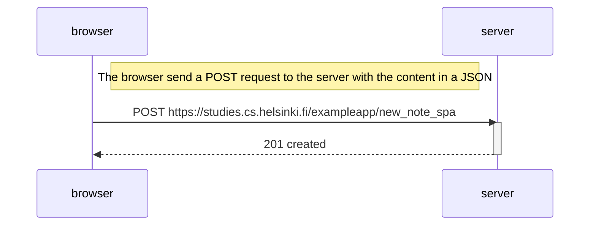

# 0.6: Uusi muistiinpano

```mermaid
sequenceDiagram
    participant browser
    participant server

    Note right of browser: The browser send a POST request to the server with the content in a JSON
    
    browser->>server: POST https://studies.cs.helsinki.fi/exampleapp/new_note_spa
    activate server
    server-->>browser: 201 created
    deactivate server
```
